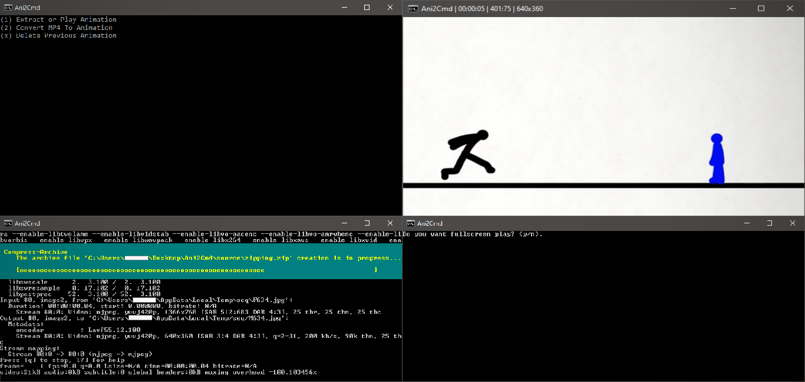
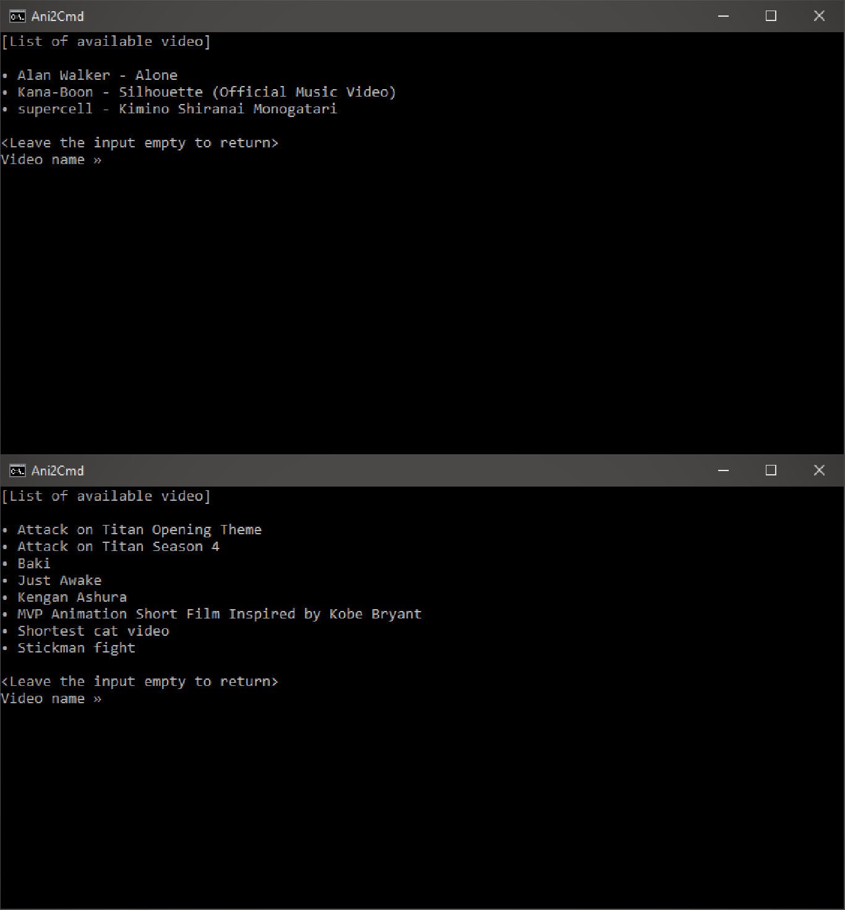

# Ani2Cmd

Ani2Cmd (Animated To Cmd) a.k.a Batch File. Is a program that allows the user to play animated video in Batch File

# Description
[Unavailable for a moment].

# Showcase

Archive Extraction and Image Sequencing

___

Video Select & Play and Video Select & Convert UI Menu

# FAQs
[Unavailable for a moment].

# Bugs & Errors
[Unavailable for a moment].

# Feedback
>To submit your feedback please send your statement in the following link:

• techlord4lyfans@gmail.com
• https://www.facebook.com/hitechgen.hi
